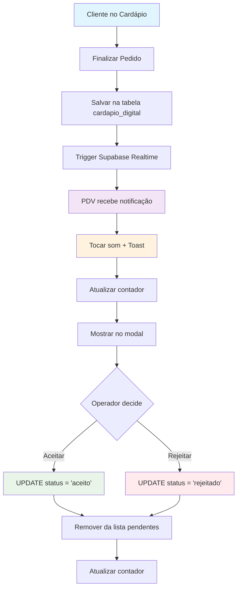

# 📋 Integração Cardápio Digital → PDV

## 📖 Visão Geral

Este documento descreve a integração completa entre o **Cardápio Digital** e o **PDV (Ponto de Venda)**, incluindo o sistema de notificações em tempo real, persistência de dados e bibliotecas utilizadas.

## 🏗️ Arquitetura do Sistema

### **Fluxo Principal**
```
Cliente (Cardápio) → Supabase (Database) → PDV (Notificações)
```

1. **Cliente** faz pedido no cardápio digital
2. **Pedido** é salvo na tabela `cardapio_digital`
3. **PDV** recebe notificação em tempo real
4. **Operador** aceita/rejeita o pedido

## 📊 Estrutura do Banco de Dados

### **Tabela: `cardapio_digital`**
```sql
CREATE TABLE cardapio_digital (
  id UUID PRIMARY KEY DEFAULT gen_random_uuid(),
  numero_pedido TEXT NOT NULL,
  empresa_id UUID NOT NULL REFERENCES empresas(id),
  nome_cliente TEXT NOT NULL,
  telefone_cliente TEXT,
  status_pedido TEXT DEFAULT 'pendente',
  data_pedido TIMESTAMP WITH TIME ZONE DEFAULT NOW(),
  valor_total DECIMAL(10,2),
  itens JSONB,
  endereco_entrega JSONB,
  forma_pagamento JSONB,
  observacoes TEXT
);
```

### **Status do Pedido**
- `pendente` - Aguardando confirmação
- `aceito` - Confirmado pelo PDV
- `rejeitado` - Recusado pelo PDV
- `preparando` - Em preparo
- `pronto` - Pronto para entrega
- `entregue` - Finalizado

## 🔧 Tecnologias e Bibliotecas

### **1. Supabase Realtime**
```typescript
// Configuração do canal realtime
const channel = supabase
  .channel(`cardapio_pedidos_${empresaId}`)
  .on('postgres_changes', {
    event: 'INSERT',
    schema: 'public',
    table: 'cardapio_digital',
    filter: `empresa_id=eq.${empresaId}`
  }, handleNovoPedido)
  .subscribe();
```

### **2. React-Toastify (Notificações)**
```bash
npm install react-toastify
```

**Configuração:**
```typescript
import { toast } from 'react-toastify';

// Notificação de sucesso
toast.success('Novo pedido recebido!', {
  position: "top-right",
  autoClose: 5000,
  hideProgressBar: false,
  closeOnClick: true,
  pauseOnHover: true,
  draggable: true
});
```

### **3. Use-Sound (Alertas Sonoros)**
```bash
npm install use-sound
```

**Implementação:**
```typescript
import useSound from 'use-sound';

const [playNotification] = useSound('/sounds/notification.mp3', {
  volume: 0.8,
  interrupt: true
});

// Tocar som quando receber pedido
const handleNovoPedido = () => {
  playNotification();
  toast.success('Novo pedido!');
};
```

## 📁 Estrutura de Arquivos

```
src/
├── hooks/
│   └── useCardapioDigitalNotifications.ts    # Hook principal
├── pages/
│   ├── dashboard/PDVPage.tsx                 # Interface do PDV
│   └── public/CardapioPublicoPage.tsx        # Cardápio público
├── components/
│   └── pdv/CardapioDigitalModal.tsx          # Modal de pedidos
└── public/
    └── sounds/
        └── notification.mp3                  # Som de notificação
```

## 🎯 Hook Principal: `useCardapioDigitalNotifications`

### **Localização:** `src/hooks/useCardapioDigitalNotifications.ts`

### **Funcionalidades:**
- ✅ Conexão realtime com Supabase
- ✅ Carregamento de pedidos pendentes
- ✅ Notificações sonoras e visuais
- ✅ Ações de aceitar/rejeitar pedidos
- ✅ Contador de pedidos pendentes

### **Parâmetros:**
```typescript
interface UseCardapioDigitalNotificationsProps {
  empresaId: string;
  enabled?: boolean;
}
```

### **Retorno:**
```typescript
interface UseCardapioDigitalNotificationsReturn {
  pedidosPendentes: PedidoCardapio[];
  contadorPendentes: number;
  isLoading: boolean;
  aceitarPedido: (pedidoId: string) => Promise<void>;
  rejeitarPedido: (pedidoId: string) => Promise<void>;
  recarregarPedidos: () => Promise<void>;
}
```

## 🔄 Fluxo de Integração

### **1. Inicialização no PDV**
```typescript
// PDVPage.tsx
const {
  pedidosPendentes,
  contadorPendentes,
  aceitarPedido,
  rejeitarPedido
} = useCardapioDigitalNotifications({
  empresaId: empresaData?.id || '',
  enabled: !!empresaData?.id
});
```

### **2. Interface do Usuário**
```typescript
// Botão com contador
<button className="relative">
  Cardápio Digital
  {contadorPendentes > 0 && (
    <span className="absolute -top-2 -right-2 bg-orange-500 text-white rounded-full px-2 py-1 text-xs animate-pulse">
      {contadorPendentes}
    </span>
  )}
</button>
```

### **3. Modal de Pedidos**
- Lista todos os pedidos pendentes
- Botões de ação (Aceitar/Rejeitar)
- Detalhes completos do pedido
- Atualização em tempo real

## 🎵 Sistema de Notificações

### **Configuração de Som**
```typescript
// Hook de som
const [playNotification] = useSound('/sounds/notification.mp3', {
  volume: 0.8,
  interrupt: true,
  onend: () => console.log('Som finalizado')
});

// Trigger automático
useEffect(() => {
  if (novoPedidoRecebido) {
    playNotification();
    toast.success('🔔 Novo pedido do cardápio digital!');
  }
}, [novoPedidoRecebido]);
```

### **Tipos de Notificação**
1. **Som** - Arquivo MP3 reproduzido automaticamente
2. **Toast** - Notificação visual no canto da tela
3. **Contador** - Badge numérico no botão
4. **Modal** - Interface completa para gerenciar pedidos

## 🔐 Segurança e Validações

### **Row Level Security (RLS)**
```sql
-- Política para empresas acessarem apenas seus pedidos
CREATE POLICY "Empresas podem ver apenas seus pedidos" 
ON cardapio_digital FOR ALL 
USING (empresa_id = auth.jwt() ->> 'empresa_id');
```

### **Validações no Frontend**
```typescript
// Verificar se empresa está autorizada
if (!empresaId || !isValidUUID(empresaId)) {
  console.error('EmpresaId inválido');
  return;
}

// Validar dados do pedido
const validarPedido = (pedido: any) => {
  return pedido.nome_cliente && 
         pedido.telefone_cliente && 
         pedido.itens?.length > 0;
};
```

## 📱 Responsividade

### **Desktop**
- Modal centralizado com largura fixa
- Lista de pedidos em grid
- Botões de ação lado a lado

### **Mobile**
- Modal em tela cheia
- Lista vertical
- Botões empilhados

```css
/* Responsivo */
@media (max-width: 768px) {
  .modal-cardapio {
    width: 100vw;
    height: 100vh;
    margin: 0;
  }
}
```

## 🐛 Debugging e Logs

### **Logs Implementados**
```typescript
// Conexão realtime
console.log('🔔 Configurando realtime para pedidos:', empresaId);

// Novos pedidos
console.log('🆕 Novo pedido recebido:', payload.new);

// Erros
console.error('❌ Erro ao carregar pedidos:', error);

// Status do canal
console.log('📡 Status do canal:', status);
```

### **Ferramentas de Debug**
1. **Console do navegador** - Logs detalhados
2. **Supabase Dashboard** - Monitorar realtime
3. **Network Tab** - Verificar requisições
4. **React DevTools** - Estado dos componentes

## 🚀 Deploy e Configuração

### **Variáveis de Ambiente**
```env
VITE_SUPABASE_URL=your_supabase_url
VITE_SUPABASE_ANON_KEY=your_anon_key
```

### **Arquivos de Som**
- Colocar em `public/sounds/notification.mp3`
- Formato: MP3, OGG ou WAV
- Tamanho recomendado: < 100KB
- Duração: 1-3 segundos

### **Build e Deploy**
```bash
npm run build
nexo-dev  # Script customizado de deploy
```

## 📈 Monitoramento

### **Métricas Importantes**
- Tempo de resposta do realtime
- Taxa de entrega de notificações
- Número de pedidos por hora
- Taxa de aceitação/rejeição

### **Logs de Produção**
```typescript
// Implementar analytics
const trackPedidoRecebido = (pedido: any) => {
  analytics.track('pedido_cardapio_recebido', {
    empresa_id: pedido.empresa_id,
    valor_total: pedido.valor_total,
    timestamp: new Date().toISOString()
  });
};
```

## 🔄 Próximos Passos

### **Melhorias Planejadas**
1. **Push Notifications** - Notificações mesmo com app fechado
2. **Webhook Integration** - Integração com sistemas externos
3. **Analytics Dashboard** - Métricas em tempo real
4. **Multi-tenant** - Suporte a múltiplas empresas
5. **Offline Support** - Funcionamento sem internet

### **Otimizações**
1. **Lazy Loading** - Carregar pedidos sob demanda
2. **Caching** - Cache inteligente de dados
3. **Compression** - Compressão de dados realtime
4. **Batching** - Agrupar notificações

## 🎯 Diagrama de Fluxo



## 🏗️ Arquitetura Técnica

```
┌─────────────────┐    ┌─────────────────┐    ┌─────────────────┐
│   Cardápio      │    │    Supabase     │    │      PDV        │
│   Digital       │    │   (Database)    │    │   Dashboard     │
│                 │    │                 │    │                 │
│ ┌─────────────┐ │    │ ┌─────────────┐ │    │ ┌─────────────┐ │
│ │   Cliente   │ │    │ │   Realtime  │ │    │ │    Hook     │ │
│ │   Faz       │ │───▶│ │   Channel   │ │───▶│ │ Notifications│ │
│ │   Pedido    │ │    │ │             │ │    │ │             │ │
│ └─────────────┘ │    │ └─────────────┘ │    │ └─────────────┘ │
│                 │    │                 │    │                 │
│ ┌─────────────┐ │    │ ┌─────────────┐ │    │ ┌─────────────┐ │
│ │ Persistência│ │    │ │   Tabela    │ │    │ │   Modal     │ │
│ │ localStorage│ │    │ │ cardapio_   │ │    │ │   Pedidos   │ │
│ │ (slug-based)│ │    │ │ digital     │ │    │ │             │ │
│ └─────────────┘ │    │ └─────────────┘ │    │ └─────────────┘ │
└─────────────────┘    └─────────────────┘    └─────────────────┘
```

## 📚 Arquivos de Documentação

Esta documentação está organizada em:

1. **README.md** - Visão geral e arquitetura
2. **EXEMPLOS_CODIGO.md** - Implementações práticas
3. **TROUBLESHOOTING.md** - Solução de problemas

## 🔗 Links Úteis

- [Supabase Realtime Docs](https://supabase.com/docs/guides/realtime)
- [React-Toastify](https://fkhadra.github.io/react-toastify/)
- [Use-Sound](https://github.com/joshwcomeau/use-sound)
- [Lucide Icons](https://lucide.dev/)

---

## 📞 Suporte

Para dúvidas ou problemas:
1. Verificar logs no console
2. Consultar TROUBLESHOOTING.md
3. Testar conexão realtime
4. Validar permissões RLS

**Desenvolvido por:** Emanuel Luis
**Data:** Janeiro 2025
**Versão:** 1.0.0
