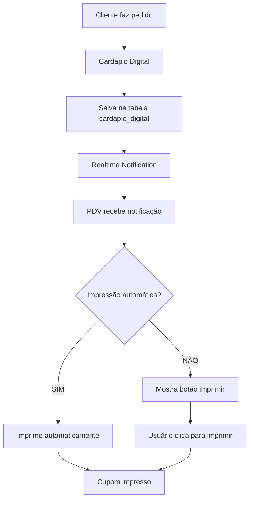

# 🖨️ Impressão do Cardápio Digital - Documentação Completa

## 📋 Índice

1. [Visão Geral](#visão-geral)
2. [Arquitetura da Solução](#arquitetura-da-solução)
3. [Configuração](#configuração)
4. [Implementação](#implementação)
5. [Estrutura de Dados](#estrutura-de-dados)
6. [Funcionalidades](#funcionalidades)
7. [Troubleshooting](#troubleshooting)
8. [Manutenção](#manutenção)

---

## 🎯 Visão Geral

A impressão do cardápio digital permite que pedidos feitos através do cardápio público sejam impressos automaticamente ou manualmente no PDV, mantendo a mesma qualidade e formatação dos cupons de venda tradicionais.

### **Características Principais:**
- ✅ **Impressão automática** configurável
- ✅ **Impressão manual** via botão no PDV
- ✅ **Suporte 50mm e 80mm** de papel
- ✅ **Layout idêntico** ao cupom de venda
- ✅ **Preços riscados** para promoções
- ✅ **Indicadores visuais** (🏷️PROMO, 📦QTD)
- ✅ **Adicionais detalhados** com preços
- ✅ **Sabores e observações** completas

---

## 🏗️ Arquitetura da Solução



### **Componentes Envolvidos:**

1. **Frontend (Cardápio Digital)**
   - `src/pages/public/CardapioPublicoPage.tsx`
   - Coleta dados do pedido e salva no banco

2. **Backend (PDV)**
   - `src/pages/dashboard/PDVPage.tsx`
   - Recebe notificações e processa impressão

3. **Banco de Dados**
   - `cardapio_digital` - Armazena pedidos
   - `pdv_config` - Configurações de impressão

4. **Sistema de Impressão**
   - `backend/public/imprimir-cupom.php`
   - Gera HTML e envia para impressora

---

## ⚙️ Configuração

### **1. Configuração no PDV**

Acesse: **PDV → Configurações → Cardápio Digital**

```typescript
interface PDVConfig {
  // Impressão automática
  impressao_automatica_cardapio: boolean;
  
  // Tipos de impressão
  tipo_impressao_50mm: boolean;
  tipo_impressao_80mm: boolean;
}
```

### **2. Configuração no Banco de Dados**

```sql
-- Habilitar impressão automática
UPDATE pdv_config 
SET impressao_automatica_cardapio = true 
WHERE empresa_id = 'sua_empresa_id';

-- Configurar tipo de impressão (50mm)
UPDATE pdv_config 
SET tipo_impressao_50mm = true, 
    tipo_impressao_80mm = false 
WHERE empresa_id = 'sua_empresa_id';
```

### **3. Configuração da Impressora**

A impressora deve estar configurada no sistema operacional e acessível via:
- **Windows**: Nome da impressora no sistema
- **Linux**: CUPS ou interface de impressão
- **Rede**: IP da impressora térmica

---

## 🔧 Implementação

### **1. Estrutura de Dados do Pedido**

```typescript
interface PedidoCardapio {
  id: string;
  numero_pedido: string;
  nome_cliente: string;
  telefone_cliente: string;
  valor_total: number;
  itens_pedido: ItemPedido[];
  observacao_pedido?: string;
  // ... outros campos
}

interface ItemPedido {
  produto_id: string;
  produto_nome: string;
  quantidade: number;
  preco_unitario: number;
  preco_original?: number; // Para preços riscados
  preco_total: number;
  promocao?: boolean;
  desconto_quantidade?: boolean;
  sabores?: Sabor[];
  adicionais?: Adicional[];
  observacao?: string;
}
```

### **2. Função de Impressão Principal**

```typescript
// src/pages/dashboard/PDVPage.tsx
const imprimirPedidoCardapio = async (pedido: any) => {
  try {
    console.log('🖨️ Iniciando impressão do pedido:', pedido.numero_pedido);
    
    // 1. Enriquecer dados com informações de promoção
    const itensEnriquecidos = itens.map(item => ({
      ...item,
      promocao: item.preco_original > item.preco_unitario,
      desconto_quantidade: item.desconto_quantidade || false
    }));

    // 2. Preparar dados para impressão
    const dadosImpressao = {
      pedido: {
        numero: pedido.numero_pedido,
        data: new Date(pedido.created_at).toLocaleString('pt-BR'),
        cliente: {
          nome: pedido.nome_cliente,
          telefone: pedido.telefone_cliente
        }
      },
      itens: itensEnriquecidos,
      total: pedido.valor_total,
      tipo: 'cardapio_digital'
    };

    // 3. Determinar tipo de impressão
    const usarImpressao50mm = pdvConfig?.tipo_impressao_50mm === true;
    
    // 4. Gerar e imprimir cupom
    await gerarEImprimirCupomCardapio(dadosImpressao, usarImpressao50mm);
    
  } catch (error) {
    console.error('Erro na impressão:', error);
    toast.error('Erro ao imprimir pedido');
  }
};
```

### **3. Geração do HTML do Cupom**

```typescript
const gerarEImprimirCupomCardapio = async (dadosImpressao: any, usarImpressao50mm: boolean) => {
  // Template HTML com formatação específica
  const htmlContent = `
    <!DOCTYPE html>
    <html>
    <head>
      <meta charset="UTF-8">
      <style>
        body { font-family: 'Courier New', monospace; margin: 0; padding: 10px; }
        .header { text-align: center; font-weight: bold; margin-bottom: 10px; }
        .item { margin-bottom: 8px; }
        .item-linha { display: flex; justify-content: space-between; }
        .valor-monetario { font-weight: bold; }
        /* Estilos específicos para promoções */
        .preco-riscado { text-decoration: line-through; color: #666; }
        .preco-promocional { color: #22c55e; font-weight: bold; }
      </style>
    </head>
    <body>
      ${gerarConteudoCupom(dadosImpressao, usarImpressao50mm)}
    </body>
    </html>
  `;

  // Enviar para impressão
  await enviarParaImpressao(htmlContent);
};
```

---

## 📊 Estrutura de Dados Detalhada

### **Tabela: cardapio_digital**

```sql
CREATE TABLE cardapio_digital (
  id UUID PRIMARY KEY DEFAULT gen_random_uuid(),
  empresa_id UUID NOT NULL,
  numero_pedido TEXT NOT NULL,
  nome_cliente TEXT NOT NULL,
  telefone_cliente TEXT,
  valor_total DECIMAL(10,2) NOT NULL,
  itens_pedido JSONB NOT NULL,
  observacao_pedido TEXT,
  status VARCHAR(20) DEFAULT 'pendente',
  created_at TIMESTAMPTZ DEFAULT NOW()
);
```

### **Configuração: pdv_config**

```sql
ALTER TABLE pdv_config ADD COLUMN IF NOT EXISTS impressao_automatica_cardapio BOOLEAN DEFAULT FALSE;
ALTER TABLE pdv_config ADD COLUMN IF NOT EXISTS tipo_impressao_50mm BOOLEAN DEFAULT FALSE;
ALTER TABLE pdv_config ADD COLUMN IF NOT EXISTS tipo_impressao_80mm BOOLEAN DEFAULT TRUE;
```

---

## 🎨 Funcionalidades Avançadas

### **1. Preços Riscados para Promoções**

```typescript
// Renderização condicional de preços
${(() => {
  if (temPromocao && precoOriginal > precoUnitario) {
    return `
      <span>
        ${quantidade} x 
        <span class="preco-riscado">${formatCurrency(precoOriginal)}</span>
        <span class="preco-promocional">${formatCurrency(precoUnitario)}</span>
        <span style="color: #22c55e;"> 🏷️PROMO</span>
      </span>
    `;
  }
})()}
```

### **2. Indicadores Visuais**

- **🏷️PROMO**: Produto em promoção tradicional
- **📦QTD**: Desconto por quantidade mínima
- **Cores**: Verde para promoções, azul para descontos

### **3. Adicionais Detalhados**

```typescript
${item.adicionais?.map(adicional => `
  <div style="margin-left: 15px; font-size: 10px; font-weight: bold;">
    + ${adicional.quantidade}x ${adicional.nome} - ${formatCurrency(adicional.preco * adicional.quantidade)}
  </div>
`).join('')}
```

### **4. Sabores e Observações**

```typescript
// Sabores (para pizzas)
${item.sabores?.length > 0 ? `
  <div style="font-size: 10px; color: #666;">
    Sabores: ${item.sabores.map(s => s.nome).join(', ')}
  </div>
` : ''}

// Observações do cliente
${item.observacao ? `
  <div style="font-size: 10px; color: #666;">
    Obs: ${item.observacao}
  </div>
` : ''}
```

---

## 🔄 Fluxo de Impressão

### **1. Impressão Automática**

```typescript
// Hook de notificações realtime
useEffect(() => {
  if (pedidosPendentes.length > 0 && pdvConfig?.impressao_automatica_cardapio) {
    pedidosPendentes.forEach(pedido => {
      if (!pedidosJaImpressos.includes(pedido.id)) {
        imprimirPedidoCardapio(pedido);
        setPedidosJaImpressos(prev => [...prev, pedido.id]);
      }
    });
  }
}, [pedidosPendentes, pdvConfig?.impressao_automatica_cardapio]);
```

### **2. Impressão Manual**

```typescript
// Botão no modal do cardápio digital
<button
  onClick={() => imprimirPedidoCardapio(pedido)}
  className="bg-blue-500 hover:bg-blue-600 text-white px-3 py-1 rounded"
>
  🖨️ Imprimir Pedido
</button>
```

---

## 🚨 Troubleshooting

### **Problemas Comuns:**

1. **Impressão não funciona**
   - Verificar se impressora está configurada
   - Verificar permissões do navegador
   - Testar com cupom de venda normal

2. **Layout quebrado**
   - Verificar tipo de impressão (50mm vs 80mm)
   - Ajustar CSS do template
   - Testar com diferentes navegadores

3. **Dados não aparecem**
   - Verificar estrutura do JSON `itens_pedido`
   - Validar enriquecimento de dados
   - Conferir logs do console

### **Logs de Debug:**

```typescript
console.log('🖨️ [CARDAPIO-PRINT] Dados do pedido:', pedido);
console.log('🖨️ [CARDAPIO-PRINT] Itens processados:', itensEnriquecidos);
console.log('🖨️ [CARDAPIO-PRINT] Tipo de impressão:', usarImpressao50mm ? '50MM' : '80MM');
```

---

## 🔧 Manutenção e Atualizações

### **Para Adicionar Novas Informações:**

1. **Atualizar estrutura de dados** em `ItemPedido`
2. **Modificar enriquecimento** em `imprimirPedidoCardapio`
3. **Ajustar template HTML** em `gerarEImprimirCupomCardapio`
4. **Testar impressão** com dados reais
5. **Atualizar documentação**

### **Exemplo de Nova Funcionalidade:**

```typescript
// 1. Adicionar campo na interface
interface ItemPedido {
  // ... campos existentes
  categoria_produto?: string; // NOVO CAMPO
}

// 2. Enriquecer dados
const itensEnriquecidos = itens.map(item => ({
  ...item,
  categoria_produto: item.categoria_produto || 'Geral' // NOVO
}));

// 3. Usar no template
${item.categoria_produto ? `
  <div style="font-size: 9px; color: #888;">
    Categoria: ${item.categoria_produto}
  </div>
` : ''}
```

---

## 📚 Referências

- **Arquivo Principal**: `src/pages/dashboard/PDVPage.tsx`
- **Configurações**: `src/pages/dashboard/ConfiguracoesPage.tsx`
- **Backend**: `backend/public/imprimir-cupom.php`
- **Banco**: `supabase/migrations/cardapio_digital.sql`

---

## ✅ Checklist de Implementação

- [ ] Configurar impressora no sistema
- [ ] Habilitar impressão automática (opcional)
- [ ] Configurar tipo de papel (50mm/80mm)
- [ ] Testar com pedido real
- [ ] Verificar layout e formatação
- [ ] Validar preços riscados
- [ ] Confirmar adicionais e observações
- [ ] Documentar configurações específicas

**🎯 A impressão do cardápio digital está totalmente integrada e funcional!**
