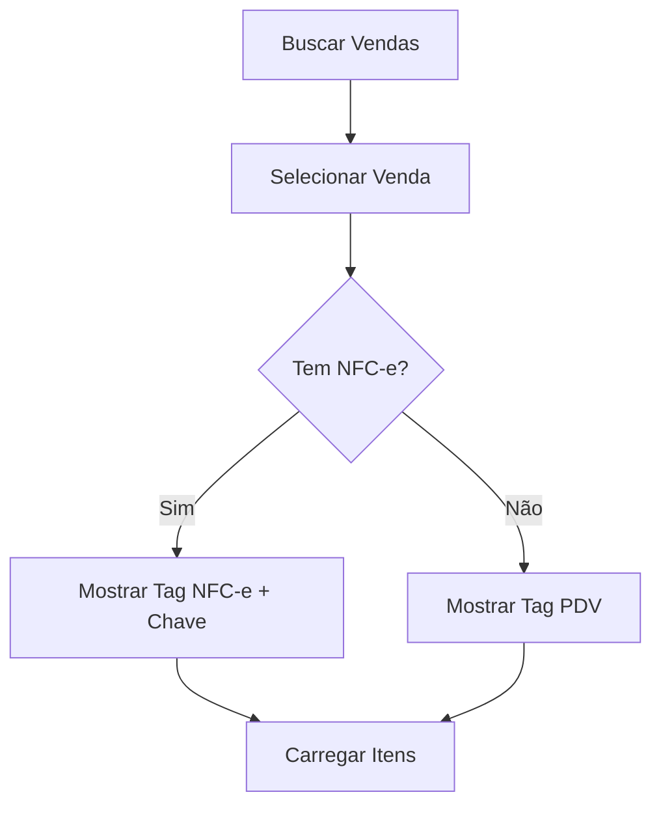
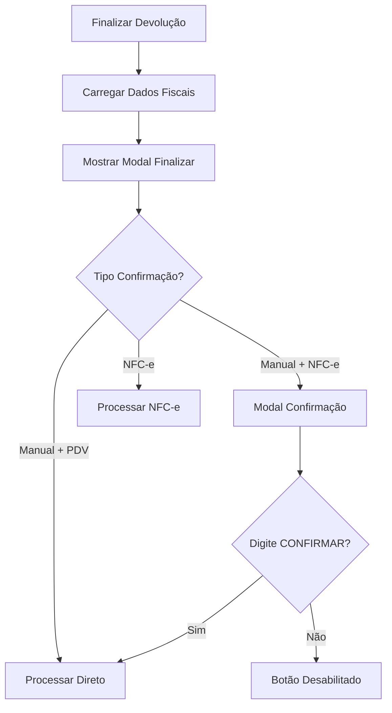

# 📋 Documentação - Sistema de Devolução NFC-e

## 🎯 **VISÃO GERAL**

Este documento descreve a implementação do sistema de devolução com suporte a NFC-e no Nexo Pedidos. O sistema permite devoluções manuais e fiscais (NFC-e) com validações específicas para cada tipo.

## 🏗️ **ARQUITETURA IMPLEMENTADA**

### **Componentes Principais**
- `NovaDevolucaoModal.tsx` - Modal principal para seleção de vendas e itens
- `FinalizarDevolucaoModal` - Modal de finalização com dados fiscais
- Modal de confirmação para devolução manual de NFC-e

### **Fluxo de Dados**
```
Vendas → Seleção de Itens → Dados Fiscais → Confirmação → Processamento
```

## 🔧 **FUNCIONALIDADES IMPLEMENTADAS**

### **1. Identificação de Vendas NFC-e**
- ✅ **Tag NFC-e/PDV** - Identifica tipo de documento fiscal
- ✅ **Chave de referência** - Exibe chave NFC-e quando disponível
- ✅ **Detecção automática** - Baseada em `modelo_documento = 65`

### **2. Dados Fiscais dos Produtos**
- ✅ **Busca automática** - Dados da tabela `produtos` usando `produto_id`
- ✅ **Campos fiscais completos**:
  - NCM, CFOP, CSOSN
  - Alíquotas ICMS, PIS, COFINS
  - Unidade de medida
  - CFOP Devolução (5202) destacado

### **3. Interface de Devolução**
- ✅ **Botões separados**:
  - "Confirmar Devolução Manual" (azul)
  - "Confirmar Devolução NFC-e" (verde)
- ✅ **Dados fiscais expandíveis** - Click para mostrar/ocultar
- ✅ **Tag HOMOLOG** - Aparece quando ambiente = 'homologacao'

### **4. Validações de Segurança**
- ✅ **Modal de confirmação** - Para devolução manual de venda NFC-e
- ✅ **Campo de confirmação** - Usuário deve digitar "CONFIRMAR"
- ✅ **Botão habilitado** - Apenas quando texto correto for digitado

## 📊 **ESTRUTURA DE DADOS**

### **Tabelas Envolvidas**
```sql
-- Vendas principais
pdv_vendas (id, numero_venda, modelo_documento, chave_nfe)

-- Itens das vendas
pdv_itens (id, pdv_id, produto_id, nome_produto, quantidade, valor_*)

-- Dados fiscais dos produtos
produtos (id, ncm, cfop, csosn_icms, aliquota_*, unidade_medida_id)

-- Unidades de medida
unidade_medida (id, sigla, nome)

-- Configuração NFe
nfe_config (empresa_id, ambiente)
```

### **Campos Críticos**
- `modelo_documento`: 65 = NFC-e, NULL = PDV
- `chave_nfe`: Chave de 44 dígitos da NFC-e
- `ambiente`: 'homologacao' | 'producao'

## 🎨 **INTERFACE VISUAL**

### **Modal "Nova Devolução"**
```
┌─────────────────────────────────────────┐
│ Nova Devolução                    [X]   │
├─────────────────────────────────────────┤
│ 🔍 Buscar vendas...                     │
│                                         │
│ ┌─ Venda #PDV-123 [NFC-e] ─────────────┐│
│ │ 02/08/2025, 04:58                   ││
│ │ Chave: 35250824163237...            ││
│ │ ┌─ Açaí 300 ml ──────────────────┐  ││
│ │ │ ☑ Qtd: 1 | R$ 5,50           │  ││
│ │ └─────────────────────────────────┘  ││
│ └─────────────────────────────────────┘│
│                                         │
│ [Finalizar Devolução]                   │
└─────────────────────────────────────────┘
```

### **Modal "Finalizar Devolução"**
```
┌─────────────────────────────────────────┐
│ Finalizar Devolução [HOMOLOG.]    [X]   │
├─────────────────────────────────────────┤
│ Venda de Origem                         │
│ #PDV-123 [NFC-e]                        │
│ Chave: 35250824163237...                │
│                                         │
│ Itens para Devolução (1)                │
│ ┌─ Açaí 300 ml [Dados Fiscais] ────────┐│
│ │ Qtd: 1 | Unit: R$ 5,50        R$ 5,00││
│ │ ┌─ Dados Fiscais ─────────────────┐  ││
│ │ │ NCM: 21069090  CFOP: 5102      │  ││
│ │ │ CFOP Devolução: 5202 (vermelho)│  ││
│ │ │ Unidade: UN - Unidade          │  ││
│ │ └─────────────────────────────────┘  ││
│ └─────────────────────────────────────┘│
│                                         │
│ [Devolução Manual] [Devolução NFC-e]    │
└─────────────────────────────────────────┘
```

## ⚠️ **VALIDAÇÕES CRÍTICAS**

### **Devolução Manual de NFC-e**
Quando usuário tenta fazer devolução manual de uma venda NFC-e:

```
┌─────────────────────────────────────────┐
│ ⚠️  Atenção: Devolução Manual de NFC-e  │
├─────────────────────────────────────────┤
│ IMPORTANTE: Esta venda foi emitida com  │
│ NFC-e. Se optar pela Devolução Manual, │
│ não será emitida uma Devolução Fiscal  │
│ e não será deduzido fiscalmente esse    │
│ valor de impostos.                      │
│                                         │
│ Digite CONFIRMAR para prosseguir:       │
│ [________________]                      │
│                                         │
│ [Cancelar] [Confirmar Devolução Manual] │
└─────────────────────────────────────────┘
```

## 🔄 **FLUXO DE PROCESSO**

### **1. Seleção de Venda**


### **2. Finalização**


## 🚀 **PRÓXIMOS PASSOS PARA IMPLEMENTAÇÃO**

### **1. Lógica de Emissão NFC-e de Devolução**
```typescript
// Implementar em: handleConfirm('nfce')
const emitirNFCeDevolucao = async (itens: ItemVenda[]) => {
  // 1. Validar dados fiscais obrigatórios
  // 2. Montar XML da NFC-e de devolução
  // 3. Enviar para SEFAZ
  // 4. Processar retorno
  // 5. Salvar na base de dados
}
```

### **2. Campos Obrigatórios para NFC-e**
- ✅ NCM do produto
- ✅ CFOP de devolução (5202)
- ✅ CSOSN/CST
- ✅ Alíquotas de impostos
- ✅ Unidade de medida
- ⏳ Chave da NFC-e original (referência)
- ⏳ Dados do emitente
- ⏳ Dados do destinatário (se houver)

### **3. Integração com API Fiscal**
```typescript
// Estrutura esperada para API
interface NFCeDevolucaoRequest {
  chave_nfe_original: string;
  cfop_devolucao: '5202';
  itens: {
    produto_id: string;
    ncm: string;
    quantidade: number;
    valor_unitario: number;
    aliquota_icms: number;
    // ... outros campos fiscais
  }[];
  ambiente: 'homologacao' | 'producao';
}
```

### **4. Tratamento de Erros**
- Validação de conectividade SEFAZ
- Tratamento de rejeições fiscais
- Fallback para devolução manual
- Logs detalhados para auditoria

### **5. Testes Necessários**
- ✅ Interface funcional
- ⏳ Emissão NFC-e homologação
- ⏳ Validação dados fiscais
- ⏳ Integração com SEFAZ
- ⏳ Cenários de erro

## 📁 **ARQUIVOS MODIFICADOS**

```
src/components/devolucao/
├── NovaDevolucaoModal.tsx          # Modal principal
└── FinalizarDevolucaoModal         # Dentro do NovaDevolucaoModal.tsx

Funcionalidades adicionadas:
├── Tag NFC-e/PDV
├── Chave de referência
├── Dados fiscais expandíveis
├── CFOP devolução destacado
├── Tag HOMOLOG condicional
├── Modal confirmação devolução manual
└── Validação "CONFIRMAR"
```

## 🎯 **STATUS ATUAL**

- ✅ **Interface completa** - Todos os componentes visuais implementados
- ✅ **Dados fiscais** - Busca e exibição funcionando
- ✅ **Validações** - Modal de confirmação implementado
- ⏳ **Lógica fiscal** - Emissão NFC-e pendente
- ⏳ **Integração API** - Conexão com SEFAZ pendente
- ⏳ **Testes** - Validação em produção pendente

**🎯 Próximo passo crítico: Implementar a lógica de emissão da NFC-e de devolução no botão "Confirmar Devolução NFC-e"**
