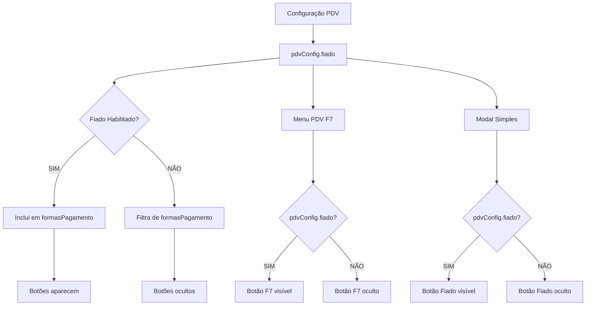

# 💳 Controle de Formas de Pagamento no PDV

## 📋 Visão Geral

Este documento explica como funcionam os botões de formas de pagamento no PDV, onde estão localizados, como são controlados e como modificá-los.

## 🎯 Problema Comum

**❌ ERRO FREQUENTE**: Tentar ocultar botões de forma de pagamento editando apenas o código JSX/HTML.

**✅ SOLUÇÃO CORRETA**: Os botões são gerados dinamicamente do banco de dados e devem ser controlados na origem dos dados.

---

## 🏗️ Arquitetura do Sistema

### **1. Fonte dos Dados**
```sql
-- Tabela que contém as formas de pagamento
SELECT * FROM formas_pag_pdv 
WHERE ativo = true 
ORDER BY ordem;
```

### **2. Carregamento no Frontend**
```typescript
// Função que carrega e filtra as formas de pagamento
const loadFormasPagamento = async () => {
  // 1. Busca dados do banco
  const { data } = await supabase.from('formas_pag_pdv')...
  
  // 2. Aplica filtros baseados na configuração PDV
  let formasFiltradas = data || [];
  if (!pdvConfig?.fiado) {
    formasFiltradas = formasFiltradas.filter(forma => 
      forma.nome?.toLowerCase() !== 'fiado'
    );
  }
  
  // 3. Atualiza estado global
  setFormasPagamento(formasFiltradas);
};
```

### **3. Renderização Dinâmica**
```typescript
// Todos os botões são gerados a partir do array filtrado
{formasPagamento.map((forma) => (
  <button key={forma.id}>
    {forma.nome} // Dinheiro, PIX, Débito, Crédito, Fiado (se habilitado)
  </button>
))}
```

---

## 📍 Localizações dos Botões

### **1. Menu PDV (Botão F7 - Fiado)**
- **Arquivo**: `src/pages/dashboard/PDVPage.tsx`
- **Linhas**: ~1104-1115 (definição) e ~1182-1185 (controle)
- **Tipo**: Hardcoded no array `menuPDVItems`
- **Controle**: Função de visibilidade baseada em `pdvConfig.fiado`

```typescript
// Definição do botão
{
  id: 'fiados',
  icon: Clock,
  label: 'Fiados',
  color: 'yellow',
  onClick: () => setShowFiadosModal(true)
}

// Controle de visibilidade
if (item.id === 'fiados') {
  return pdvConfig?.fiado === true;
}
```

### **2. Modal de Pagamento Simples**
- **Arquivo**: `src/pages/dashboard/PDVPage.tsx`
- **Linhas**: ~10106-10126
- **Tipo**: Hardcoded com renderização condicional
- **Controle**: Baseado em `pdvConfig.fiado`

```typescript
<div className={`grid gap-3 ${pdvConfig?.fiado ? 'grid-cols-2' : 'grid-cols-3'}`}>
  {/* Botões fixos: Dinheiro, Cartão, PIX */}
  
  {/* Botão Fiado condicional */}
  {pdvConfig?.fiado && (
    <button>Fiado</button>
  )}
</div>
```

### **3. Modal de Finalização (Formas Dinâmicas)**
- **Arquivo**: `src/pages/dashboard/PDVPage.tsx`
- **Linhas**: ~9131-9143 (à vista) e ~9289-9301 (com pedidos)
- **Tipo**: Dinâmico do banco de dados
- **Controle**: Array `formasPagamento` filtrado

```typescript
// Renderização dinâmica
<div className="grid grid-cols-2 gap-1.5">
  {formasPagamento.map((forma) => (
    <button key={forma.id}>
      {forma.nome} // Inclui ou exclui "Fiado" automaticamente
    </button>
  ))}
</div>
```

---

## ⚙️ Sistema de Controle

### **1. Configuração PDV**
- **Tabela**: `pdv_config`
- **Campo**: `fiado` (boolean)
- **Padrão**: `false` (desabilitado)
- **Interface**: Configurações → PDV → Geral → Checkbox "Fiado"

### **2. Fluxo de Controle**


### **3. Recarregamento Automático**
```typescript
// useEffect que monitora mudanças na configuração
useEffect(() => {
  if (pdvConfig !== null) {
    loadFormasPagamento(); // Recarrega e refiltra automaticamente
  }
}, [pdvConfig?.fiado]); // Executa quando configuração muda
```

---

## 🔧 Como Modificar

### **✅ Para Ocultar/Mostrar Formas de Pagamento:**

#### **1. Via Configuração (Recomendado)**
```typescript
// Modificar a função loadFormasPagamento
if (!pdvConfig?.novaConfiguracao) {
  formasFiltradas = formasFiltradas.filter(forma => 
    forma.nome?.toLowerCase() !== 'nome_da_forma'
  );
}
```

#### **2. Via Banco de Dados**
```sql
-- Desativar forma de pagamento
UPDATE formas_pag_pdv 
SET ativo = false 
WHERE nome = 'Nome da Forma';

-- Reativar forma de pagamento
UPDATE formas_pag_pdv 
SET ativo = true 
WHERE nome = 'Nome da Forma';
```

#### **3. Adicionar Nova Forma**
```sql
-- Inserir nova forma de pagamento
INSERT INTO formas_pag_pdv (nome, tipo, ativo, ordem, empresa_id)
VALUES ('Nova Forma', 'tipo', true, 10, 'empresa_id');
```

### **❌ O Que NÃO Fazer:**

1. **Não editar apenas o JSX**: Os botões são gerados dinamicamente
2. **Não usar CSS para ocultar**: Pode causar inconsistências
3. **Não modificar apenas um local**: Existem múltiplos pontos de renderização

---

## 🧪 Como Testar

### **1. Teste de Configuração**
```bash
# 1. Acesse: http://nexodev.emasoftware.app
# 2. Vá para: Configurações → PDV → Geral
# 3. Alterne: Checkbox "Fiado"
# 4. Verifique: Todos os modais de pagamento
```

### **2. Teste de Banco de Dados**
```sql
-- Verificar formas ativas
SELECT nome, ativo, ordem FROM formas_pag_pdv 
WHERE empresa_id = 'sua_empresa_id' 
ORDER BY ordem;
```

### **3. Teste de Filtros**
```typescript
// Console do navegador
console.log('Formas carregadas:', formasPagamento);
console.log('Config Fiado:', pdvConfig?.fiado);
```

---

## 🚨 Troubleshooting

### **Problema: Botão não desaparece**
- ✅ Verificar se `pdvConfig` foi carregado
- ✅ Verificar se `useEffect` está executando
- ✅ Limpar cache do navegador
- ✅ Verificar console para erros

### **Problema: Botão não aparece quando habilitado**
- ✅ Verificar se existe registro na tabela `formas_pag_pdv`
- ✅ Verificar se `ativo = true`
- ✅ Verificar se filtro não está removendo incorretamente

### **Problema: Inconsistência entre modais**
- ✅ Verificar se todos usam o mesmo array `formasPagamento`
- ✅ Verificar se não há hardcoding em algum local
- ✅ Verificar se `useEffect` está atualizando todos os estados

---

## 📚 Arquivos Relacionados

- **Principal**: `src/pages/dashboard/PDVPage.tsx`
- **Tipos**: `src/types.ts` (interface PDVConfig)
- **Configurações**: `src/pages/dashboard/ConfiguracoesPage.tsx`
- **Migrações**: `supabase/migrations/*pdv_config*`

---

## 🎯 Resumo Executivo

**Para controlar botões de forma de pagamento:**

1. **Fonte única**: Array `formasPagamento` filtrado na função `loadFormasPagamento`
2. **Controle central**: Configuração `pdvConfig.fiado`
3. **Recarregamento automático**: `useEffect` monitora mudanças
4. **Renderização dinâmica**: Todos os modais usam o mesmo array filtrado

**Nunca edite apenas o JSX - sempre controle na origem dos dados!**

---

## 💡 Exemplos Práticos

### **Exemplo 1: Adicionar Nova Forma de Pagamento**

#### **1. Inserir no Banco**
```sql
INSERT INTO formas_pag_pdv (nome, tipo, ativo, ordem, empresa_id)
VALUES ('Cartão Presente', 'eletronico', true, 5, 'sua_empresa_id');
```

#### **2. Adicionar Controle (se necessário)**
```typescript
// Em loadFormasPagamento, adicionar filtro se precisar de controle específico
if (!pdvConfig?.cartao_presente) {
  formasFiltradas = formasFiltradas.filter(forma =>
    forma.nome?.toLowerCase() !== 'cartão presente'
  );
}
```

#### **3. Adicionar Configuração**
```sql
-- Adicionar campo na tabela pdv_config
ALTER TABLE pdv_config ADD COLUMN cartao_presente BOOLEAN DEFAULT FALSE;
```

### **Exemplo 2: Ocultar Temporariamente uma Forma**

#### **Método 1: Via Configuração (Recomendado)**
```typescript
// Adicionar filtro temporário em loadFormasPagamento
if (true) { // Condição temporária
  formasFiltradas = formasFiltradas.filter(forma =>
    forma.nome?.toLowerCase() !== 'débito'
  );
}
```

#### **Método 2: Via Banco (Permanente)**
```sql
UPDATE formas_pag_pdv
SET ativo = false
WHERE nome = 'Débito' AND empresa_id = 'sua_empresa_id';
```

### **Exemplo 3: Reordenar Formas de Pagamento**
```sql
-- Alterar ordem de exibição
UPDATE formas_pag_pdv SET ordem = 1 WHERE nome = 'PIX';
UPDATE formas_pag_pdv SET ordem = 2 WHERE nome = 'Dinheiro';
UPDATE formas_pag_pdv SET ordem = 3 WHERE nome = 'Crédito';
UPDATE formas_pag_pdv SET ordem = 4 WHERE nome = 'Débito';
UPDATE formas_pag_pdv SET ordem = 5 WHERE nome = 'Fiado';
```

---

## 🔍 Debug e Monitoramento

### **Console Commands para Debug**
```javascript
// No console do navegador (F12)

// 1. Verificar formas carregadas
console.log('Formas de pagamento:', window.formasPagamento);

// 2. Verificar configuração PDV
console.log('Config PDV:', window.pdvConfig);

// 3. Forçar recarregamento das formas
window.loadFormasPagamento();

// 4. Verificar estado atual
console.log('Estado atual:', {
  formas: window.formasPagamento?.length,
  fiado: window.pdvConfig?.fiado,
  filtradas: window.formasPagamento?.map(f => f.nome)
});
```

### **Logs Úteis no Código**
```typescript
// Adicionar em loadFormasPagamento para debug
console.log('🔄 Carregando formas de pagamento...');
console.log('📊 Dados do banco:', data);
console.log('⚙️ Config fiado:', pdvConfig?.fiado);
console.log('✅ Formas filtradas:', formasFiltradas);
console.log('🎯 Total de formas:', formasFiltradas.length);
```

---

## 📊 Estrutura da Tabela

### **formas_pag_pdv**
```sql
CREATE TABLE formas_pag_pdv (
  id UUID PRIMARY KEY DEFAULT uuid_generate_v4(),
  nome VARCHAR(100) NOT NULL,           -- Nome exibido no botão
  tipo VARCHAR(50),                     -- Tipo da forma (eletronico, dinheiro, etc)
  ativo BOOLEAN DEFAULT TRUE,           -- Se está ativo/visível
  ordem INTEGER DEFAULT 0,              -- Ordem de exibição
  empresa_id UUID REFERENCES empresas(id),
  created_at TIMESTAMPTZ DEFAULT NOW(),
  updated_at TIMESTAMPTZ DEFAULT NOW()
);
```

### **Dados Padrão**
```sql
-- Formas de pagamento padrão do sistema
INSERT INTO formas_pag_pdv (nome, tipo, ordem, ativo) VALUES
('Dinheiro', 'dinheiro', 1, true),
('PIX', 'eletronico', 2, true),
('Crédito', 'eletronico', 3, true),
('Débito', 'eletronico', 4, true),
('Fiado', 'fiado', 5, true);
```

---

## 🎨 Customização Visual

### **Cores dos Botões**
```typescript
// Cores hardcoded por tipo no Modal Simples
const getCoresBotao = (nome: string) => {
  switch(nome.toLowerCase()) {
    case 'dinheiro': return 'bg-green-500/20 border-green-500/30 text-green-400';
    case 'pix': return 'bg-purple-500/20 border-purple-500/30 text-purple-400';
    case 'cartão': return 'bg-blue-500/20 border-blue-500/30 text-blue-400';
    case 'fiado': return 'bg-orange-500/20 border-orange-500/30 text-orange-400';
    default: return 'bg-gray-500/20 border-gray-500/30 text-gray-400';
  }
};
```

### **Ícones dos Botões**
```typescript
// Ícones hardcoded por tipo
const getIconeBotao = (nome: string) => {
  switch(nome.toLowerCase()) {
    case 'dinheiro': return <DollarSign size={24} />;
    case 'pix': return <Calculator size={24} />;
    case 'cartão': return <CreditCard size={24} />;
    case 'fiado': return <Receipt size={24} />;
    default: return <CreditCard size={24} />;
  }
};
```

---

## 🚀 Melhorias Futuras

### **1. Sistema de Ícones Dinâmico**
```sql
-- Adicionar campo de ícone na tabela
ALTER TABLE formas_pag_pdv ADD COLUMN icone VARCHAR(50);

UPDATE formas_pag_pdv SET icone = 'DollarSign' WHERE nome = 'Dinheiro';
UPDATE formas_pag_pdv SET icone = 'Calculator' WHERE nome = 'PIX';
-- etc...
```

### **2. Sistema de Cores Dinâmico**
```sql
-- Adicionar campos de cor
ALTER TABLE formas_pag_pdv ADD COLUMN cor_fundo VARCHAR(50);
ALTER TABLE formas_pag_pdv ADD COLUMN cor_borda VARCHAR(50);
ALTER TABLE formas_pag_pdv ADD COLUMN cor_texto VARCHAR(50);
```

### **3. Configurações Avançadas**
```sql
-- Adicionar mais controles na configuração PDV
ALTER TABLE pdv_config ADD COLUMN formas_pagamento_personalizadas JSONB;

-- Exemplo de estrutura JSON:
{
  "ocultar": ["débito", "crédito"],
  "renomear": {
    "pix": "PIX Instantâneo",
    "dinheiro": "Dinheiro à Vista"
  },
  "cores_customizadas": {
    "pix": "#8B5CF6"
  }
}
```

---

## ✅ Checklist de Implementação

Ao modificar formas de pagamento, sempre verificar:

- [ ] Dados inseridos/atualizados na tabela `formas_pag_pdv`
- [ ] Filtros aplicados na função `loadFormasPagamento`
- [ ] useEffect configurado para recarregamento automático
- [ ] Configuração PDV atualizada (se necessário)
- [ ] Testado em todos os modais de pagamento
- [ ] Testado com configuração habilitada/desabilitada
- [ ] Cache do navegador limpo para teste
- [ ] Documentação atualizada

**🎯 Lembre-se: Uma fonte de dados, múltiplos pontos de renderização!**
