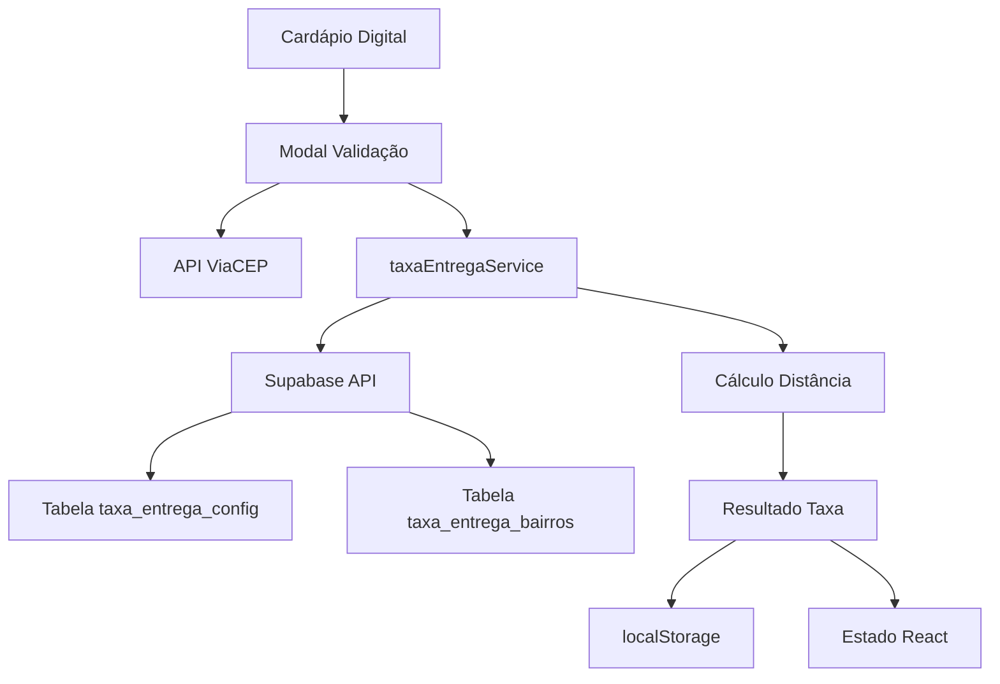
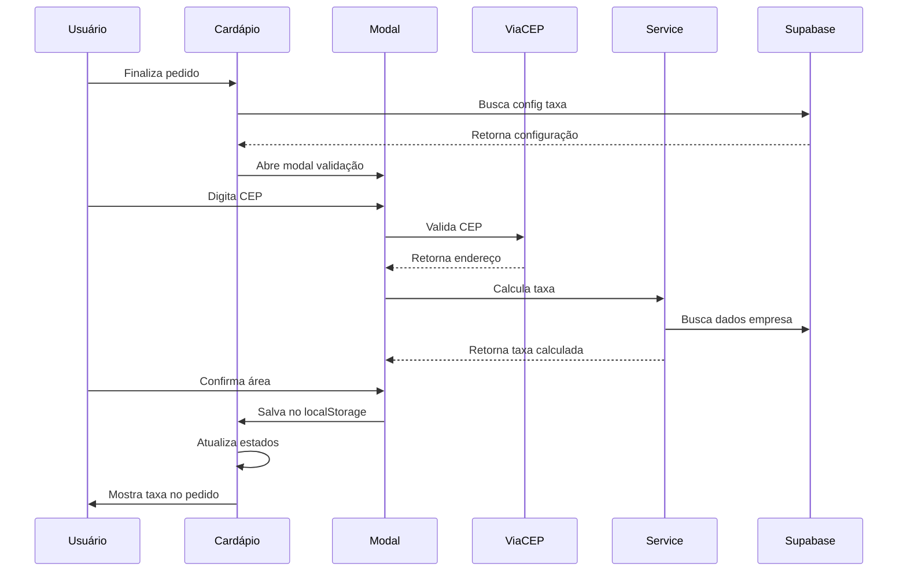
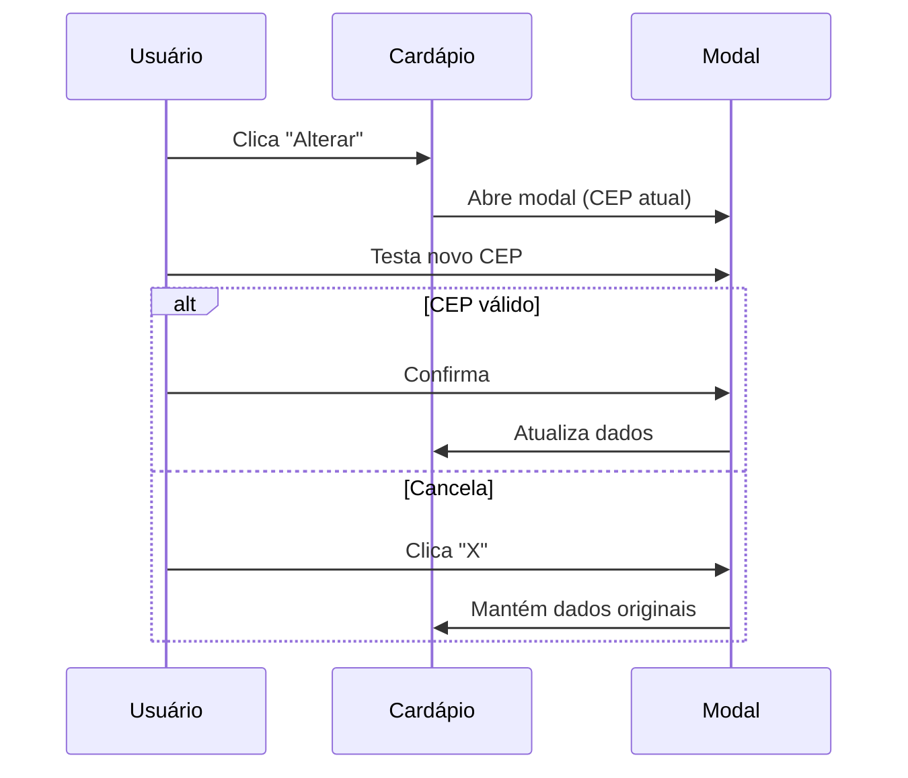

# 🚚 Sistema de Taxa de Entrega - Documentação Técnica

## 📋 Índice
- [Visão Geral](#visão-geral)
- [Arquitetura do Sistema](#arquitetura-do-sistema)
- [Estrutura do Banco de Dados](#estrutura-do-banco-de-dados)
- [API e Serviços](#api-e-serviços)
- [Implementação Frontend](#implementação-frontend)
- [Fluxos de Funcionamento](#fluxos-de-funcionamento)
- [Estados e Persistência](#estados-e-persistência)
- [Correções e Melhorias](#correções-e-melhorias)
- [Manutenção e Troubleshooting](#manutenção-e-troubleshooting)

---

## 🎯 Visão Geral

O Sistema de Taxa de Entrega permite que empresas configurem e calculem automaticamente taxas de entrega baseadas em:
- **Distância**: Cálculo por CEP usando coordenadas geográficas
- **Bairro**: Taxa fixa por bairro cadastrado

### Características Principais:
- ✅ Validação de CEP via API ViaCEP
- ✅ Cálculo de distância usando coordenadas lat/lng
- ✅ Configuração flexível por empresa
- ✅ Interface intuitiva no cardápio digital
- ✅ Persistência de dados no localStorage
- ✅ Sistema de fallback e validação

---

## 🏗️ Arquitetura do Sistema



### Componentes Principais:
1. **Frontend**: React + TypeScript
2. **Backend**: Supabase (PostgreSQL)
3. **APIs Externas**: ViaCEP para validação de CEP
4. **Serviços**: taxaEntregaService para lógica de negócio

---

## 🗄️ Estrutura do Banco de Dados

### Tabela: `taxa_entrega_config`
```sql
CREATE TABLE taxa_entrega_config (
  id UUID PRIMARY KEY DEFAULT gen_random_uuid(),
  empresa_id UUID NOT NULL REFERENCES empresas(id),
  habilitado BOOLEAN DEFAULT false,
  tipo VARCHAR(20) CHECK (tipo IN ('distancia', 'bairro')),
  endereco_origem TEXT,
  latitude_origem DECIMAL(10,8),
  longitude_origem DECIMAL(11,8),
  raio_maximo_km DECIMAL(5,2),
  taxa_base DECIMAL(10,2),
  taxa_por_km DECIMAL(10,2),
  tempo_base_minutos INTEGER,
  tempo_por_km_minutos DECIMAL(5,2),
  created_at TIMESTAMP DEFAULT NOW(),
  updated_at TIMESTAMP DEFAULT NOW()
);
```

### Tabela: `taxa_entrega_bairros`
```sql
CREATE TABLE taxa_entrega_bairros (
  id UUID PRIMARY KEY DEFAULT gen_random_uuid(),
  empresa_id UUID NOT NULL REFERENCES empresas(id),
  bairro VARCHAR(255) NOT NULL,
  valor DECIMAL(10,2) NOT NULL,
  tempo_entrega INTEGER, -- em minutos
  created_at TIMESTAMP DEFAULT NOW(),
  updated_at TIMESTAMP DEFAULT NOW()
);
```

---

## 🔧 API e Serviços

### taxaEntregaService.ts

**Localização**: `/src/services/taxaEntregaService.ts`

#### Principais Funções:

```typescript
// Buscar configuração da empresa
async buscarConfiguracao(empresaId: string): Promise<TaxaEntregaConfig | null>

// Calcular taxa por distância ou bairro
async calcularTaxa(empresaId: string, cep: string): Promise<CalculoTaxaResult | null>

// Buscar bairros disponíveis
async buscarBairros(empresaId: string): Promise<TaxaEntregaBairro[]>
```

#### Fluxo de Cálculo por Distância:

1. **Validar CEP**: Via API ViaCEP
2. **Obter Coordenadas**: Converter endereço em lat/lng
3. **Calcular Distância**: Fórmula de Haversine
4. **Verificar Raio**: Se está dentro do raio máximo
5. **Calcular Taxa**: `taxa_base + (distancia_km * taxa_por_km)`
6. **Calcular Tempo**: `tempo_base + (distancia_km * tempo_por_km)`

#### Exemplo de Resposta:
```typescript
interface CalculoTaxaResult {
  valor: number;           // Taxa em reais
  distancia_km: number;    // Distância calculada
  tempo_estimado: string;  // "30-45 min"
  fora_area: boolean;      // Se está fora do raio
  endereco_origem: string; // Endereço da empresa
  endereco_destino: string; // Endereço do cliente
}
```

---

## 💻 Implementação Frontend

### Arquivo Principal: `CardapioPublicoPage.tsx`

**Localização**: `/src/pages/public/CardapioPublicoPage.tsx`

#### Estados Principais:
```typescript
// Configuração da taxa
const [taxaEntregaConfig, setTaxaEntregaConfig] = useState<TaxaEntregaConfig | null>(null);

// Estados de validação
const [modalAreaEntregaAberto, setModalAreaEntregaAberto] = useState(false);
const [areaValidada, setAreaValidada] = useState(false);

// CEP e endereço
const [cepCliente, setCepCliente] = useState('');
const [cepClienteTemp, setCepClienteTemp] = useState(''); // CEP temporário para edição
const [enderecoEncontrado, setEnderecoEncontrado] = useState<EnderecoViaCEP | null>(null);

// Cálculo da taxa
const [calculoTaxa, setCalculoTaxa] = useState<CalculoTaxaResult | null>(null);
const [validandoCep, setValidandoCep] = useState(false);
const [cepForaArea, setCepForaArea] = useState(false);

// Para tipo bairro
const [bairrosDisponiveis, setBairrosDisponiveis] = useState<TaxaEntregaBairro[]>([]);
const [bairroSelecionado, setBairroSelecionado] = useState('');
```

#### Funções Principais:

```typescript
// Validar CEP via ViaCEP e calcular taxa
const validarCEP = async (cep: string) => { ... }

// Confirmar área de entrega validada
const confirmarAreaEntrega = () => { ... }

// Abrir modal sem limpar dados
const abrirModalAlteracao = () => { ... }

// Fechar modal sem salvar mudanças
const fecharModalAlteracao = () => { ... }

// Alterar endereço (reset completo)
const alterarEndereco = () => { ... }
```

---

## 🔄 Fluxos de Funcionamento

### 1. Primeira Validação (Usuário Novo)



### 2. Alteração de Endereço



### 3. Persistência de Dados

**localStorage Keys:**
- `area_validada_${empresaId}`: "true"
- `cep_cliente_${empresaId}`: "12345-678"
- `endereco_encontrado_${empresaId}`: JSON do endereço
- `taxa_entrega_${empresaId}`: JSON da taxa calculada
- `bairro_selecionado_${empresaId}`: "Centro" (para tipo bairro)

---

## 💾 Estados e Persistência

### Sistema de CEP Temporário

**Problema Resolvido**: Evitar perda de dados durante edição

```typescript
// CEP real (protegido)
const [cepCliente, setCepCliente] = useState('');

// CEP temporário (para edição)
const [cepClienteTemp, setCepClienteTemp] = useState('');
```

**Fluxo**:
1. **Abrir modal**: `cepClienteTemp = cepCliente`
2. **Editar**: Altera apenas `cepClienteTemp`
3. **Confirmar**: `cepCliente = cepClienteTemp`
4. **Cancelar**: `cepClienteTemp = ''` (mantém `cepCliente`)

### Carregamento de Dados Salvos

```typescript
const confirmarAreaEntrega = () => {
  // ... salvar no localStorage ...
  
  // Carregar dados nos estados para exibição
  if (empresaId) {
    const cepSalvo = localStorage.getItem(`cep_cliente_${empresaId}`);
    const enderecoSalvoStr = localStorage.getItem(`endereco_encontrado_${empresaId}`);
    const taxaSalvaStr = localStorage.getItem(`taxa_entrega_${empresaId}`);

    if (cepSalvo) setCepCliente(cepSalvo);
    if (enderecoSalvoStr) setEnderecoEncontrado(JSON.parse(enderecoSalvoStr));
    if (taxaSalvaStr) setCalculoTaxa(JSON.parse(taxaSalvaStr));
  }
};
```

---

## 🔧 Correções e Melhorias

### Problema 1: CEP Perdido ao Fechar Modal

**Sintoma**: Ao testar CEP inválido e fechar modal, CEP original sumia

**Causa**: Modal editava diretamente o estado `cepCliente`

**Solução**: Sistema de CEP temporário
- Edição isolada em `cepClienteTemp`
- Proteção do `cepCliente` original
- Sincronização apenas ao confirmar

### Problema 2: Taxa Não Aparecia Após Validação

**Sintoma**: Após validar CEP, seção de taxa não aparecia no pedido

**Causa**: Estados não sincronizados com localStorage

**Solução**: Carregamento automático após confirmação
- Salvar no localStorage
- Carregar nos estados React
- Garantir condição `taxaEntregaConfig && areaValidada && calculoTaxa`

### Problema 3: Botão Fechar Ausente

**Sintoma**: Usuário não conseguia cancelar alteração de endereço

**Solução**: Botão "X" no header do modal
- Função `fecharModalAlteracao()`
- Restaura estado original
- UX intuitiva

---

## 🛠️ Manutenção e Troubleshooting

### Logs e Debug

**Console Logs Importantes**:
```javascript
console.log('🚚 Calculando taxa de entrega para CEP:', cep);
console.log('📍 Coordenadas origem:', lat, lng);
console.log('📍 Coordenadas destino:', destLat, destLng);
console.log('📏 Distância calculada:', distancia, 'km');
console.log('💰 Taxa calculada:', taxa);
```

### Verificações Comuns

1. **Taxa não aparece**:
   - Verificar se `taxaEntregaConfig.habilitado = true`
   - Confirmar se `areaValidada = true`
   - Checar se `calculoTaxa` não é null

2. **CEP não valida**:
   - Testar API ViaCEP manualmente
   - Verificar formato do CEP (8 dígitos)
   - Confirmar conexão com internet

3. **Distância incorreta**:
   - Verificar coordenadas da empresa
   - Testar cálculo de Haversine
   - Confirmar raio máximo configurado

### Configuração de Empresa

**Passos para configurar taxa por distância**:
1. Acessar Dashboard > Taxa de Entrega
2. Habilitar sistema
3. Selecionar tipo "Distância"
4. Configurar endereço origem
5. Definir raio máximo (km)
6. Configurar taxa base e por km
7. Definir tempos de entrega

**Passos para configurar taxa por bairro**:
1. Habilitar sistema
2. Selecionar tipo "Bairro"
3. Cadastrar bairros com valores
4. Definir tempos de entrega

### APIs Externas

**ViaCEP**: `https://viacep.com.br/ws/{cep}/json/`
- Rate limit: Sem limite oficial
- Formato CEP: 8 dígitos sem hífen
- Resposta: JSON com logradouro, bairro, cidade, UF

**Geocoding** (se implementado):
- Google Maps API ou similar
- Para converter endereço em coordenadas
- Necessário API key

---

## 📚 Referências Técnicas

### Arquivos Principais:
- `/src/services/taxaEntregaService.ts` - Lógica de negócio
- `/src/pages/public/CardapioPublicoPage.tsx` - Interface usuário
- `/src/pages/dashboard/TaxaEntregaPage.tsx` - Configuração admin

### Dependências:
- React 18+ com TypeScript
- Supabase Client
- Lucide React (ícones)
- Framer Motion (animações)

### Fórmulas Utilizadas:
- **Haversine**: Cálculo de distância entre coordenadas
- **Taxa**: `base + (distancia * taxa_por_km)`
- **Tempo**: `base + (distancia * tempo_por_km)`

---

*Documentação criada em: 19/07/2025*  
*Última atualização: 19/07/2025*  
*Versão: 1.0*
