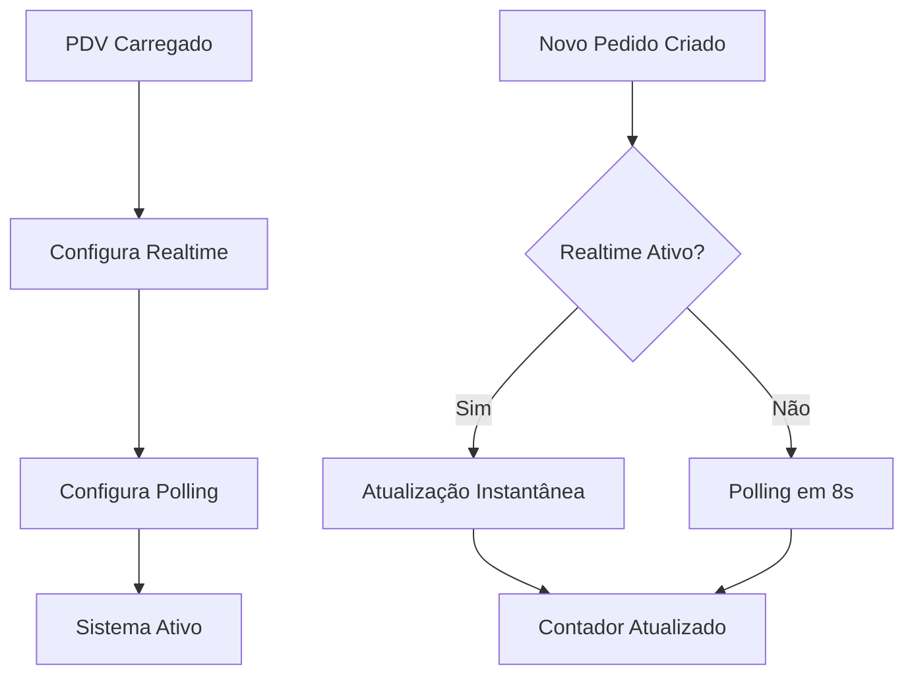

# Sistema de Contador Automático - PDV

## Visão Geral

O sistema de contador automático do PDV foi implementado para atualizar em tempo real o número de pedidos pendentes no menu do PDV, sem necessidade de intervenção manual ou recarregamento da página.

## Funcionalidades

### 🔄 Atualização Automática
- **Tempo Real**: Atualização instantânea via Supabase Realtime
- **Backup Automático**: Polling a cada 8 segundos como fallback
- **Zero Intervenção**: Funciona completamente automático

### 📊 Contador Visual
- **Posicionamento**: Canto superior direito do botão "Pedidos"
- **Tamanho**: 22x22px para melhor visibilidade
- **Cores**: Fundo vermelho com texto branco
- **Responsivo**: Adapta-se ao layout do menu

## Implementação Técnica

### Estratégia Dupla de Atualização

#### 1. Supabase Realtime (Primário)
```typescript
supabase
  .channel(`pedidos-realtime-${empresaId}`)
  .on('postgres_changes', {
    event: '*', // INSERT, UPDATE, DELETE
    schema: 'public',
    table: 'pedidos',
    filter: `empresa_id=eq.${empresaId}`
  }, (payload) => {
    loadContadorPedidos(); // Atualização instantânea
  })
```

#### 2. Polling Automático (Backup)
```typescript
setInterval(() => {
  loadContadorPedidos();
}, 8000); // A cada 8 segundos
```

### Função de Contagem
```typescript
export const contarPedidosPendentes = async (empresaId: string): Promise<number> => {
  const { count } = await supabase
    .from('pedidos')
    .select('*', { count: 'exact', head: true })
    .eq('empresa_id', empresaId)
    .eq('status', 'pendente')
    .eq('deletado', false);
  
  return count || 0;
};
```

## Configuração do Supabase

### Requisitos
1. **Realtime habilitado** na tabela `pedidos`
2. **RLS (Row Level Security)** configurado
3. **Filtros por empresa** implementados

### Verificação do Realtime
1. Acesse o painel do Supabase
2. Vá em **Database** → **Replication**
3. Certifique-se que a tabela `pedidos` está com Realtime ativo

## Eventos Monitorados

### INSERT (Novo Pedido)
- **Trigger**: Quando um novo pedido é criado
- **Ação**: Recalcula contador se status = 'pendente'
- **Log**: `🆕 Novo pedido criado via Realtime`

### UPDATE (Status Alterado)
- **Trigger**: Quando status do pedido muda
- **Ação**: Recalcula contador completo
- **Log**: `📝 Pedido atualizado via Realtime`

### DELETE (Pedido Removido)
- **Trigger**: Quando pedido é deletado
- **Ação**: Recalcula contador completo
- **Log**: `🗑️ Pedido deletado via Realtime`

## Logs de Debug

### Console do Navegador
```
🔄 Configurando Realtime para empresa: 123
📡 Status da subscription Realtime: SUBSCRIBED
✅ Realtime configurado com sucesso!
🔄 Configurando atualização automática...
```

### Em Caso de Erro
```
❌ Erro no Realtime, usando polling como fallback
🔄 Configurando atualização automática...
```

## Fluxo de Funcionamento



## Vantagens do Sistema

### ⚡ Performance
- **Instantâneo**: Realtime atualiza imediatamente
- **Eficiente**: Polling apenas como backup
- **Leve**: Não sobrecarrega o sistema

### 🛡️ Confiabilidade
- **Dupla Proteção**: Realtime + Polling
- **Sempre Funciona**: Mesmo com falhas de rede
- **Auto-Recuperação**: Reconecta automaticamente

### 🎯 Precisão
- **Filtro por Empresa**: Só conta pedidos da empresa atual
- **Status Correto**: Apenas pedidos pendentes
- **Soft Delete**: Ignora pedidos deletados

## Troubleshooting

### Contador Não Atualiza
1. **Verificar Console**: Procurar logs de erro
2. **Realtime Status**: Verificar se está SUBSCRIBED
3. **Polling Ativo**: Deve atualizar em 8 segundos
4. **Filtros**: Verificar empresa_id correto

### Realtime Não Funciona
- **Fallback Automático**: Polling assume automaticamente
- **Sem Impacto**: Sistema continua funcionando
- **Verificar Configuração**: Realtime habilitado no Supabase

### Performance
- **Intervalo Otimizado**: 8 segundos é equilibrado
- **Cache Inteligente**: Evita requisições desnecessárias
- **Cleanup Automático**: Remove listeners ao sair da página

## Manutenção

### Monitoramento
- **Logs do Console**: Acompanhar status das conexões
- **Performance**: Verificar tempo de resposta
- **Erros**: Monitorar falhas de conexão

### Atualizações
- **Intervalo de Polling**: Ajustável conforme necessidade
- **Filtros**: Podem ser refinados para melhor performance
- **Eventos**: Novos eventos podem ser adicionados

## Conclusão

O sistema de contador automático garante que o PDV sempre exiba informações atualizadas sobre pedidos pendentes, proporcionando uma experiência fluida e confiável para os usuários, sem necessidade de intervenção manual.
